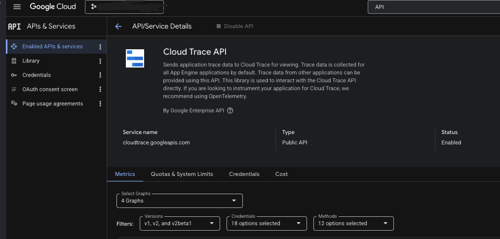
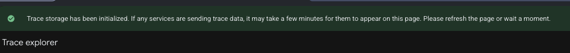
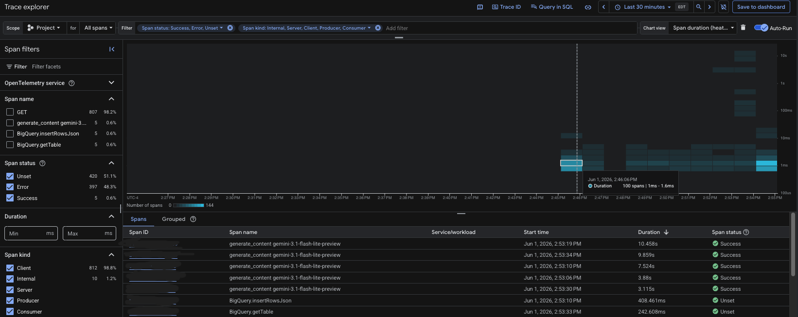
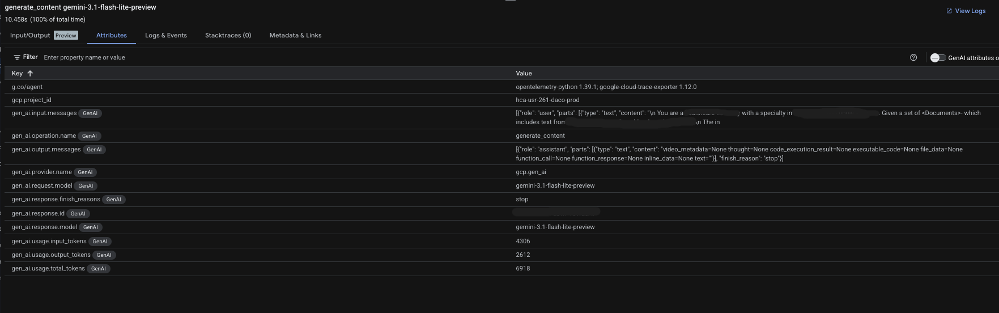

# OpenLLMetry and Google Cloud Platform Integration Tutorial (UNFINISHED)
## Introduction
LLMs can be costly and can be prone to hallucinations. Best to monitor token usage, model drift, and cost.

Tools:
* OpenLLMetry
* Google Cloud Trace Explorer
* Gemini 3.1 Flash Lite

## Connection 
You have your Python LLM project managed by uv ready to go. Now we need to step up observability and tracing for all your LLM calls

Step 1: Install OpenLLMetry using uv

`uv add traceloop-sdk`

Step 2: Install Google OpenTelemtry Exporter
Since we are using Google Cloud Trace, we do not need to set any Traceloop environment variables. We can instead install the google open telemetry exporter - which OpenLLMetry will automatically detect

`uv add opentelemetry-exporter-gcp-trace`

Step 3: Initialize Traceloop in Your Code
Add the following code to the entry point of your script. In this case, I added it to the top of my main.py file.
You will want to add an import statement
```
from traceloop.sdk import Traceloop
from opentelemetry.exporter.cloud_trace import CloudTraceSpanExporter
from opentelemetry.exporter.cloud_monitoring import CloudMonitoringMetricsExporter
from opentelemetry.exporter.cloud_logging import CloudLoggingExporter
```
and an initialization call
```
trace_exporter = CloudTraceSpanExporter()
metrics_exporter = CloudMonitoringMetricsExporter
logs_exporter = CloudLoggingExporter()

Traceloop.init(
  app_name="your-app-service",
  exporter=trace_exporter,
  metrics_exporter=metrics_exporter,
  logging_exporter=logs_exporter
)
```

Step 4: Ensure Cloud Trace API is enabled for your project


Step 5: Enable Trace Storage (the option should be available in the Trace explorer UI)


Step 6: Ensure your service account has all required roles (if using GCP). Some may include:
* Cloud Telemetry Metric Writer
* Cloud Trace Agent
* Cloud Trace User
* Logs Writer
* Monitoring Editor

Step 7: Run your python app
```
uv run main.py
```

or if using a cloud run job, execute the job
```
gcloud run jobs execute LLM_APP_JOB_NAME
```

Step 8: View Traces in Trace Explorer


If you click on one of the trace spans, you can view more metrics! In the following example, I can see the prompt, token count, and other metadata passed to the gemini model api call.



## References
* [OpenLLMetry GCP Integration Docs](https://www.traceloop.com/docs/openllmetry/integrations/gcp)
* [OpenLLMetry Docs](https://github.com/traceloop/openllmetry)
* [Google Cloud Observability Docs](https://docs.cloud.google.com/stackdriver/docs)
